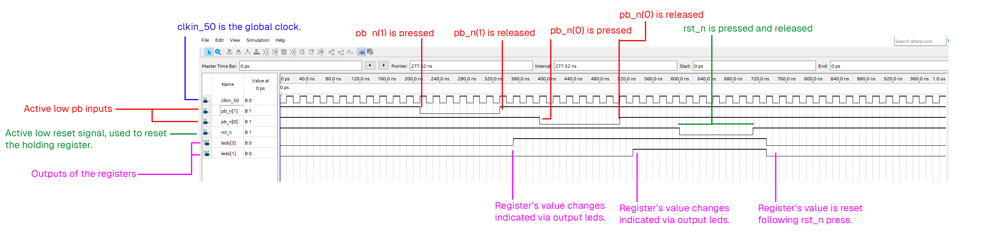
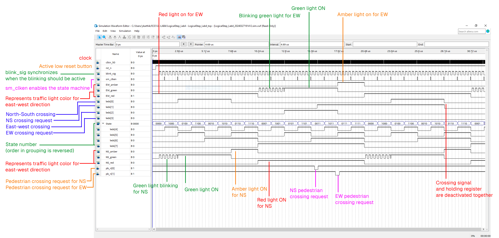
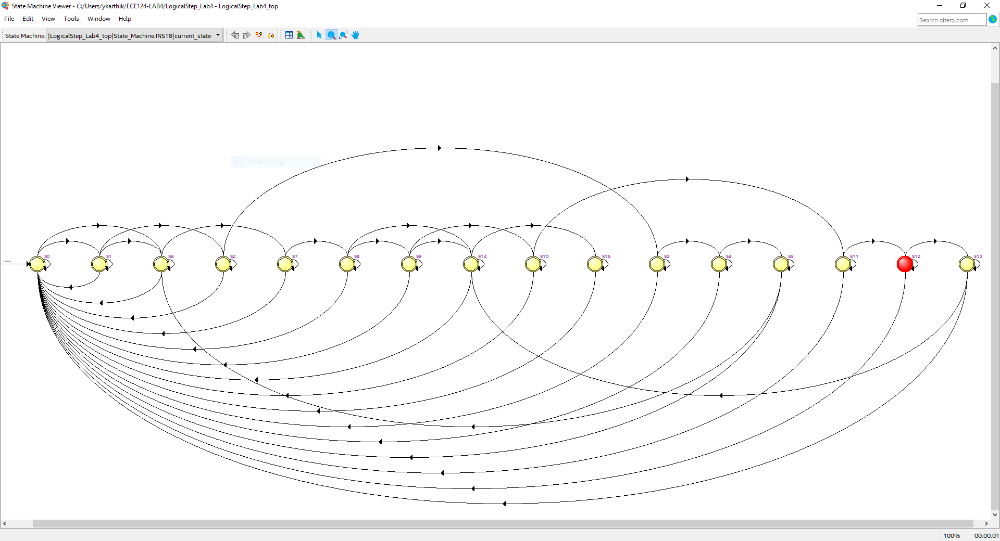
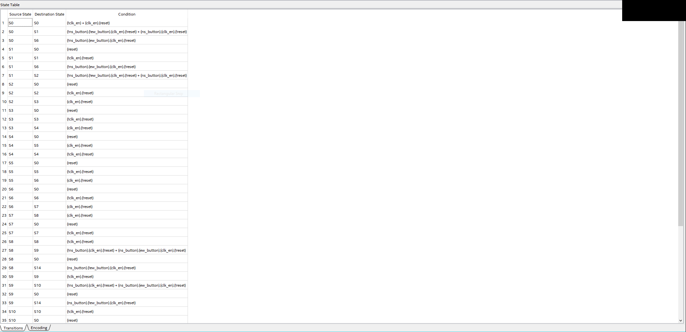
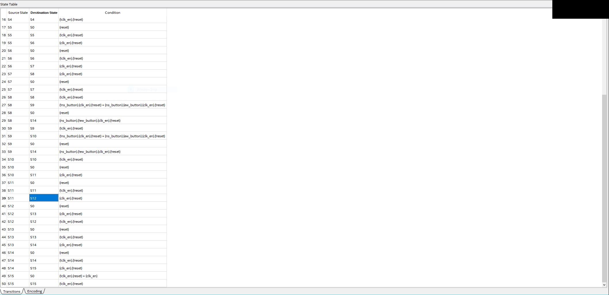

\begin{center}
\huge{\textbf{Lab 4 Report}}\\
\text{ECE 124}\\
\text{Group 3 - Session 203}\\
\textbf{Yashashwin Karthikeyan}\\
\texttt{LS203\char`_T03\char`_Lab4\char`_REPORT\char`_Yashashwin\char`_Karthikeyan}
\end{center}

\newpage

# Top level file: `LogicalStep_Lab4_top.vhd`

```vhdl {.numberLines}
-- Section 203
-- Group 3: Yashashwin Karthikeyan and Roozbeh Ali
LIBRARY ieee;
USE ieee.std_logic_1164.ALL;
USE ieee.numeric_std.ALL;

ENTITY LogicalStep_Lab4_top IS PORT (
  clkin_50: in	std_logic;  -- The 50 MHz FPGA Clockinput
  rst_n: in	std_logic;      -- The RESET input (ACTIVE LOW)
  pb_n: in	std_logic_vector(3 downto 0); -- The push-button inputs (ACTIVE LOW)
  sw: in  std_logic_vector(7 downto 0);   -- The switch inputs
  leds: out std_logic_vector(7 downto 0); -- for displaying the the lab4 project details
  seg7_data: out std_logic_vector(6 downto 0); -- 7-bit outputs to a 7-segment
  seg7_char1: out	std_logic;   -- seg7 digi selectors
  seg7_char2: out	std_logic;   -- seg7 digi selectors
  
  -------------------------------------------------------------
  -- Temporary Signals for Waveform Analysis, Must be Commented Out for Board Flashing
  -------------------------------------------------------------
  
  sm_clken: out std_logic; -- Clock enable from the clock generator
  blink_sig: out std_logic; -- Blinking signal from the clock generator
  NS_green: out std_logic; -- Green color for NS
  NS_amber: out std_logic; -- Amber color for NS
  NS_red: out std_logic; -- Red color for NS
  EW_green: out std_logic; -- Green color for EW
  EW_amber: out std_logic; -- Amber color for EW
  EW_red: out std_logic  -- Red color for EW
); END LogicalStep_Lab4_top;

------------------------------------------------------------------------------------------------------------------

ARCHITECTURE SimpleCircuit OF LogicalStep_Lab4_top IS
  component segment7_mux port (
    clk: in  std_logic := '0';
   	DIN2: in  std_logic_vector(6 downto 0); --bits 6 to 0 represent segments G,F,E,D,C,B,A
   	DIN1: in  std_logic_vector(6 downto 0); --bits 6 to 0 represent segments G,F,E,D,C,B,A
   	DOUT: out	std_logic_vector(6 downto 0);
   	DIG2: out	std_logic;
   	DIG1: out	std_logic
  );
  end component;
  
  component clock_generator port (
   	sim_mode: in boolean;
   	reset: in std_logic;
    clkin: in  std_logic;
   	sm_clken: out	std_logic;
   	blink: out std_logic
  ); end component;
  
  component pb_filters port (
    clkin: in std_logic;
    rst_n: in std_logic;
    rst_n_filtered: out std_logic;
    pb_n: in  std_logic_vector (3 downto 0);
    pb_n_filtered: out	std_logic_vector(3 downto 0)							 
  ); end component;
  
  component pb_inverters port (
    rst_n: in  std_logic;
    rst: out	std_logic;							 
    pb_n_filtered: in  std_logic_vector (3 downto 0);
    pb: out	std_logic_vector(3 downto 0)							 
  ); end component;
   
  component synchronizer port(
    input: in std_logic;
    global_clock: in std_logic;
    reset: in std_logic; -- sync reset
    output: out std_logic
  ); end component; 
  
  component holding_register port (
    clk: in std_logic;
    reset: in std_logic;
    register_clr: in std_logic;
    din: in std_logic;
    dout: out std_logic
  ); end component;

  component State_Machine port (
    clk_input, reset, clk_en, blink_seg: IN std_logic;
    ns_button, ew_button: IN std_logic;
    ns_green, ns_amber, ns_red: OUT std_logic;
    ew_green, ew_amber, ew_red: OUT std_logic;
    display_state: OUT std_logic_vector(3 downto 0);
    ns_regclear, ew_regclear: OUT std_logic;
    ns_crosslight, ew_crosslight: OUT std_logic
  ); END component;

----------------------------------------------------------------------------------------------------
  -- set to FALSE for LogicalStep board downloads
  CONSTANT	sim_mode: boolean := TRUE;

  -- Active high reset button after filtering,
  -- filtered reset button, and the synchronous reset after its input syncher
  SIGNAL rst, rst_n_filtered, synch_rst: std_logic;

  -- Temporary signal to map to the blink signal output from the clock generator
  SIGNAL blink: std_logic;

  -- vectors to represent the push buttons on the board after filtering and after inverting
  SIGNAL pb_n_filtered, pb: std_logic_vector(3 downto 0);

  -- vector to map the output of the synchronous inputs to the holding registers
  SIGNAL sync_out: std_logic_vector(1 downto 0);

  SIGNAL ns_green_l: std_logic;  -- The green signal for NS light
  SIGNAL ns_amber_l: std_logic;  -- The amber signal for NS light
  SIGNAL ns_red_l: std_logic;    -- The Red signal for NS light
  SIGNAL ew_green_l: std_logic;  -- The Green signal for EW light
  SIGNAL ew_amber_l: std_logic;  -- The Amber signal for EW light
  SIGNAL ew_red_l: std_logic;    -- The RED signal for EW light
  SIGNAL ew_register: std_logic  	-- The register clear for EW holding input
  SIGNAL ns_register: std_logic  	-- The register clear for NS holding input
  SIGNAL ew_button: std_logic;   -- The button indicator for the EW pedestrian button (LED)
  SIGNAL ns_button: std_logic;   -- The button indicator for the NS pedestrian button (LED)
  SIGNAL clk_enable: std_logic;  -- Clk_enable for the register to be taken from the clock generator
	
BEGIN
----------------------------------------------------------------------------------------------------
INST0: pb_filters port map (
  clkin_50,
  rst_n,
  rst_n_filtered,
  pb_n,
  pb_n_filtered);

INST1: pb_inverters	port map (
  rst_n_filtered,
  rst,
  pb_n_filtered,
  pb);					

INST2: synchronizer port map (
  rst,
  clkin_50,
  synch_rst,
  synch_rst);  -- Registers to sync inputs with each other

INST3: synchronizer port map (
  pb(1),
  clkin_50,
  synch_rst,
  sync_out(1));

INST4: synchronizer	port map (
  pb(0),
  clkin_50,
  synch_rst,
  sync_out(0));

INST5: clock_generator 	port map (
  sim_mode,
  synch_rst,
  clkin_50,
  clk_enable,
  blink); -- Generates the enabling signal for the state machine and the blinking signal

INST6: holding_register port map (
  clkin_50,
  synch_rst,
  ew_register,
  sync_out(1),
  ew_button); -- EW pedestrian button input holder

INST7: holding_register port map (
  clkin_50,
  synch_rst,
  ns_register,
  sync_out(0),
  ns_button); -- NS pedestrian button input holder

INST8: STATE_MACHINE port map (
  clkin_50,
  synch_rst,
  clk_enable,
  blink,
  ns_button,
  ew_button,
  ns_green_l,
  ns_amber_l,
  ns_red_l,
  ew_green_l,
  ew_amber_l,
  ew_red_l,
  leds(7 downto 4),
  ns_register,
  ew_register,
  leds(0),
  leds(2)); 

-- output signals for the traffic lights are concatenated
INST9: segment7_mux port map(
  clkin_50,
  ns_amber_l & "00" & ns_green_l & "00" & ns_red_l,
  ew_amber_l & "00" & ew_green_l & "00" & ew_red_l,
  seg7_data,
  seg7_char2,
  seg7_char1); 

leds(3) <= ew_button;
leds(1) <= ns_button;

NS_green <= ns_green_l;
NS_amber <= ns_amber_l;
NS_red <= ns_red_l;
EW_green <= ew_green_l;
EW_amber <= ew_amber_l;
EW_red <= ew_red_l;
blink_sig <= blink;
sm_clken <= clk_enable;

END SimpleCircuit;
```
---

# Subordinate file: `PB_inverters.vhd`

```vhdl {.numberLines}
-- Section 203
-- Group 3: Yashashwin Karthikeyan and Roozbeh Ali
library ieee;
use ieee.std_logic_1164.all;

-- maps the pb switches from active low to active high
entity PB_inverters is port (
  rst_n: in	std_logic; -- Active low reset
  rst: out std_logic; -- Active high
  pb_n_filtered: in  std_logic_vector (3 downto 0); -- Button inputs after filtering, active low
  pb: out	std_logic_vector(3 downto 0)	-- Button inputs, now active high
); end PB_inverters;

architecture inv of PB_inverters is
begin
  rst <= NOT(rst_n);
  pb <= NOT(pb_n_filtered);
end inv;
```
---

# Subordinate file: `State_Machine.vhd`

```vhdl {.numberLines}
-- Section 203
-- Group 3: Yashashwin Karthikeyan and Roozbeh Ali
library ieee;
use ieee.std_logic_1164.all;
use ieee.numeric_std.all;

Entity State_Machine IS Port (
  -- Global clk, synch reset to reset whole board, enable from clk generator,
 clk_input, reset, clk_en, blink_seg: IN std_logic;
 -- and blink_seg produced by clk generator to be used in the blinking green
 ns_button, ew_button: IN std_logic; -- Input from the holding registers for the pedestrian buttons
 ns_green, ns_amber, ns_red: OUT std_logic;	-- The color outputs for NS
 ew_green, ew_amber, ew_red: OUT std_logic;	-- The color outputs for EW
 display_state: OUT std_logic_vector(3 downto 0); -- State to be displayed on leds(7 downto 4)
 ns_regclear, ew_regclear: OUT std_logic; 	-- Pedestrian button clears
 ns_crosslight, ew_crosslight: OUT std_logic	-- Output signal for pedetestrian crossing
); END ENTITY;

architecture sm of State_Machine is
TYPE STATE_NAMES IS (S0,S1,S2,S3,S4,S5,S6,S7,S8,S9,S10,S11,S12,S13,S14,S15); -- 16 States

SIGNAL current_state, next_state: STATE_NAMES;

begin
-- Register Logic
Register_Section: PROCESS(clk_input)
begin
  if (rising_edge(clk_input)) then
    if (reset = '1') then       -- used to reset state to S0 if reset is pressed
    	current_state <= S0;
    elsif (clk_en = '1') then   -- state progresses to next_state only if clk_en = 1
    	current_state <= next_state;
  	end if;
  end if;
end process;

-- Transition Logic: used to compute the next state of the state machine
Transition_Section: PROCESS(current_state, ew_button, ns_button)
begin
	case current_state is
		when S0 =>
            -- Skip red light duration (NS) if requested
			if (ew_button = '1' and ns_button = '0') then
				next_state <= S6;
			else
				next_state <= S1;
			end if;
		when S1 =>
            -- Skip red light duration (NS) if requested
			if (ew_button = '1' and ns_button = '0') then
				next_state <= S6;
			else
				next_state <= S2;
			end if;
		when S2 =>
			next_state <= S3;
		when S3 =>
			next_state <= S4;
		when S4 =>
			next_state <= S5;
		when S5 =>
			next_state <= S6;
		when S6 =>
			next_state <= S7;
		when S7 =>
			next_state <= S8;
		when S8 =>
            -- Skip red light duration (EW) if requested
			if (ns_button = '1' and ew_button = '0') then
				next_state <= S14;
			else 
				next_state <= S9;
			end if;
		when S9 =>
            -- Skip red light duration (EW) if requested
			if (ns_button = '1' and ew_button = '0') then
				next_state <= S14;
			else 
				next_state <= S10;
			end if;
		when S10 =>
			next_state <= S11;
		when S11 =>
			next_state <= S12;
		when S12 =>
			next_state <= S13;
		when S13 =>
			next_state <= S14;
		when S14 =>
			next_state <= S15;
		when S15 =>
			next_state <= S0;
	end case;
end process;

-- Decoder section: used to compute the output of the state machine.
Decoder_Section: PROCESS (current_state)
begin	
        -- Ensure the registers do not clear on any case where not specified,
		ew_regclear <= '0';
		ns_regclear <= '0'; 
	case current_state is 
		WHEN S0 =>
			display_state <= "0000";
		WHEN S1 =>
			display_state <= "0001";
		WHEN S2 =>
			display_state <= "0010";
		WHEN S3 =>
			display_state <= "0011";
		WHEN S4 =>
			display_state <= "0100";
		WHEN S5 =>
			display_state <= "0101";
		WHEN S6 =>
            -- NS button holding register is cleared at state 6 as per project specifications
			ns_regclear <= '1';
			display_state <= "0110";
		WHEN S7 =>
			display_state <= "0111";
		WHEN S8 =>
			display_state <= "1000";
		WHEN S9 =>
			display_state <= "1001";
		WHEN S10 =>
			display_state <= "1010";
		WHEN S11 =>
			display_state <= "1011";
		WHEN S12 =>
			display_state <= "1100";
		WHEN S13 =>
			display_state <= "1101";
		WHEN S14 =>
            -- EW button holding register is cleared at state 14 as per project specifications
			ew_regclear <= '1';
			display_state <= "1110";
		WHEN S15 =>
			display_state <= "1111";
	end case;

	case current_state is
		WHEN S0 | S1 =>
			-- Blinking Green NS, RED EW
			ns_green <= blink_seg;
			ns_amber <=	'0';
			ns_red <= '0';
			ew_green <='0';
			ew_amber <='0';
			ew_red <='1';
			ns_crosslight <='0';
			ew_crosslight <='0';
			
		WHEN S2 | S3 | S4 | S5 =>
			-- GREEN NS, RED EW
			ns_green <= '1';
			ns_amber <=	'0';
			ns_red <= '0';
			ew_green <= '0';
			ew_amber <= '0';
			ew_red <= '1';
			ns_crosslight <= '1';
			ew_crosslight <= '0';
			
		WHEN S6 | S7 =>
			-- AMBER NS, RED EW
			ns_green <= '0';
			ns_amber <=	'1';
			ns_red <= '0';
			ew_green <= '0';
			ew_amber <= '0';
			ew_red <= '1';
			ns_crosslight <= '0';
			ew_crosslight <= '0';
		
		WHEN S8 | S9 =>
			-- RED NS, BLINKING GREEN EW
			ns_green <= '0';
			ns_amber <=	'0';
			ns_red <= '1';
			ew_green <=	blink_seg;
			ew_amber <=	'0';
			ew_red <=	'0';
			ns_crosslight <= '0';
			ew_crosslight <= '0';
		
		WHEN S10 | S11 | S12 | S13 =>
			-- RED NS, GREEN EW
			ns_green <= '0';
			ns_amber <=	'0';
			ns_red <= '1';
			ew_green <=	'1';
			ew_amber <= '0';
			ew_red <='0';
			ns_crosslight <= '0';
			ew_crosslight <= '1';
		
		WHEN S14 | S15 =>
			-- RED NS, AMBER EW
			ns_green <= '0';
			ns_amber <=	'0';
			ns_red <= '1';
			ew_green <= '0';
			ew_amber <= '1';
			ew_red <= '0';
			ns_crosslight <= '0';
			ew_crosslight <= '0';
	end case;
end process;
end architecture sm;
```
---

# Subordinate file: `holding_register.vhd`

```vhdl {.numberLines}
-- Section 203
-- Group 3: Yashashwin Karthikeyan and Roozbeh Ali
library ieee;	
use ieee.std_logic_1164.all;

-- Register to hold the input after the user presses one of the pedestrian buttons
entity holding_register is port (
  clk: in std_logic;
  reset: in std_logic;
  register_clr: in std_logic;
  din: in std_logic;
  dout: out std_logic
); end holding_register;
 
architecture circuit of holding_register is	
	Signal sreg				: std_logic; -- value of register
BEGIN
	process(clk) is
	begin
		if (rising_edge(clk)) then
            -- Reset on register_clear or reset
			sreg <= (not(register_clr or reset)) and (din or sreg);
		end if;
    -- no else block, hence latch is inferred
	
	end process;
	
  dout <= sreg; -- sreg outputs to output of the block
end circuit;
```
---

# Subordinate file: `synchronizer.vhd`

```vhdl {.numberLines}
-- Section 203, Group 3
-- Yashashwin Karthikeyan
-- Roozbeh Ali
library ieee;
use ieee.std_logic_1164.all;
use ieee.numeric_std.all;

-- Synchronizes an input based on the clock
Entity synchronizer IS Port
(
	input : in std_logic;
	global_clock : in std_logic;
	reset 	: in std_logic; -- Note this is a syncronized reset
	output : out std_logic
);
end entity;

architecture main of synchronizer is
signal reg : std_logic; -- Register storage signal

begin

	process(global_clock) is
	begin
		if (rising_edge(global_clock)) then
			if (reset = '0') then -- If user doesn't want a reset, shift-register
				reg <= input;
				output <= reg;
			else
				reg <= '0'; -- Reset register values
				output <= '0';
			end if;
		end if;
	end process;
end main;
```
---

# Images and Annotations










